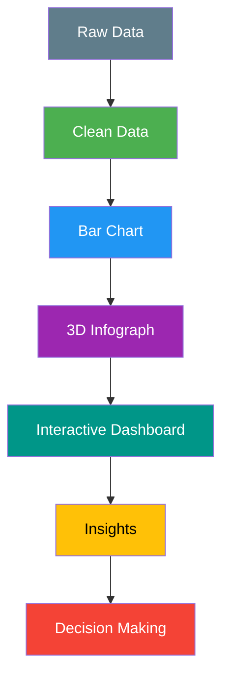

# 📊 Excel 3D Infograph Visualization — Interactive Dashboard Project

<p align="center">
  
</p>

<p align="center">
<b>From Basic Bar Charts → Advanced 3D Infographics → Interactive Dashboards</b><br>
Building Data Storytelling Skills using Microsoft Excel
</p>

---

# 🚀 Repository Overview

```txt
Domain            : Data Analytics / Visualization
Tool              : Microsoft Excel
Project Type      : Dashboard + Infographic Design
Skill Level       : Beginner → Advanced
Visualization     : Bar Chart → 3D Infograph
Interactivity     : Slicers & Dynamic Filtering
Outcome           : End-to-End Excel Dashboard
```

---

# 🔥 Project Evolution (Key Highlight)

This repository demonstrates **progressive learning**:

### 🔹 Phase 1: Basic Visualization

📊 Bar Chart Dashboard
📁 File:
👉 [https://github.com/Ashwin18-Offcl/Excel-3-D-info-graph/blob/main/ADVANCE.xlsx](https://github.com/Ashwin18-Offcl/Excel-3-D-info-graph/blob/main/ADVANCE.xlsx)

* Built foundational **bar chart visualization**
* Compared categorical data effectively
* Learned chart structuring & formatting
* Developed understanding of **data vs visual mapping**

📌 Bar charts are ideal for comparing categories like sales by region or product ([Graphed][1])

---

### 🔹 Phase 2: Advanced 3D Infograph

📊 3D Infographic Dashboard

* Designed **visually rich dashboard**
* Used shapes, icons, layered charts
* Created storytelling-based layout
* Focused on presentation + insights

---

### 🔹 Phase 3: Interactive Dashboard

* Added **slicers for filtering**
* Enabled dynamic data exploration
* Converted static report → interactive tool

📌 Slicers allow users to filter dashboards with simple clicks, making reports dynamic ([TechRepublic][2])

---

# 🧠 End-to-End Workflow

🔍 **Problem** → 🗂️ **Dataset** → 🧹 **Prep** → 🧮 **Formulas** → 📊 **Bar Chart** → 📊 **3D Infograph** → 🎛️ **Slicers** → 📈 **Trends** → 🎯 **Action**

---

# 📊 Visual Workflow Diagram


---

# 📊 Detailed Project Breakdown

## 🔹 1. Problem Understanding

* Identify business questions
* Define KPIs and metrics
* Focus on decision-making goals

---

## 🔹 2. Dataset Handling

* Structured Excel tables
* Organized categorical data
* Clean and consistent dataset

📌 Clean data is essential for reliable dashboards and insights ([XLS Library][3])

---

## 🔹 3. Data Preparation

* Removed inconsistencies
* Standardized formats
* Prepared data for charts

---

## 🔹 4. Calculations

* Applied Excel formulas
* Created KPI metrics
* Derived insights-ready values

---

## 🔹 5. Visualization Layer

### ✅ Basic Level

* Bar chart (ADVANCE.xlsx)
* Category comparison

### ✅ Advanced Level

* 3D Infographic design
* Multi-chart storytelling layout

📌 Dashboards combine multiple charts to present insights clearly ([XLS Library][3])

---

## 🔹 6. Interactivity

* Slicers for filtering
* Dynamic chart updates
* User-friendly controls

📌 Interactive dashboards allow users to explore data instead of just viewing it ([Oboe][4])

---

## 🔹 7. Trend Analysis

* Identify patterns
* Compare categories
* Analyze performance

---

## 🔹 8. Insights & Decisions

* Highlight key findings
* Simplify complex data
* Enable data-driven decisions

---

# 📊 Dashboard Architecture



---

# 📊 Skills Demonstrated

| Skill Area          | Capability                     |
| ------------------- | ------------------------------ |
| Data Cleaning       | Structured dataset preparation |
| Excel Charts        | Bar chart & 3D visualization   |
| Dashboard Design    | Layout & storytelling          |
| Interactivity       | Slicers & filters              |
| Analytical Thinking | Data → Insight transformation  |
| UI/UX in Excel      | Clean professional dashboard   |

---

# 🎛️ Dashboard Features

✔ Bar Chart Visualization (ADVANCE.xlsx)
✔ 3D Infographic Dashboard
✔ KPI Metrics Display
✔ Interactive Slicers
✔ Clean UI & Layout
✔ Data Storytelling

---

# 📈 Key Insights

✔ Category-wise comparison
✔ Performance tracking
✔ Trend identification
✔ KPI visualization
✔ Simplified data interpretation

---

# 🎯 Business Impact

✔ Faster decision-making
✔ Improved reporting quality
✔ Better data communication
✔ Enhanced visual storytelling
✔ Portfolio-ready project

---

# 📁 Repository Structure

```txt
📁 Excel-3-D-Info-Graph
│
├── 📊 ADVANCE.xlsx (Bar Chart Visualization)
├── 📊 3D Infographic Dashboard
├── 🖼 Thumbnail
├── 📄 README.md
```

---

# 🏆 What This Shows Recruiters

✔ Beginner → Advanced progression

✔ Strong Excel visualization skills

✔ Understanding of dashboards

✔ Ability to build interactive reports

✔ Real-world analytical thinking

---

# 🧭 Who Is This For?

✔ Excel Beginners

✔ Data Analyst Aspirants

✔ Dashboard Designers

✔ Students building portfolios

✔ Business Analysts

---

# 🚀 Career Impact

✔ Portfolio-ready project

✔ Demonstrates Excel expertise

✔ Builds strong visualization skills

✔ Helps in Data Analyst interviews

✔ Foundation for Power BI / Tableau

---

# 📊 Summary

This project showcases transformation:

📉 Raw Data → 📊 Bar Chart → 🎨 3D Infograph → 🎛️ Interactive Dashboard → 📈 Insights → 🎯 Decisions

---

# 🧑‍💻 Author

**Ashwin Ananta Panbude**
Data Analyst | Excel | Python | Power BI

<p align="center">
  <a href="https://github.com/Ashwin18-Offcl">
    
  </a>
  <a href="https://bit.ly/49pSuZJ">
    
  </a>
</p>

---

